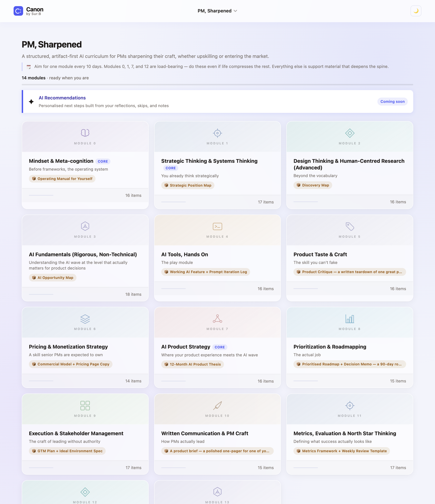

# Canon

> Curate your curriculum. Execute it. Track it. Come out sharp.

Canon is a personal learning workspace. Curate a curriculum, execute it module by module, track progress, and write as you go. Built solo during a career break using Claude Code.

**[Live](https://surabhibatra29.github.io/canon/curriculum-tracker.html)** · **[Intro video (2 min)](https://www.loom.com/share/02c93c7ead8e4b37a517bffa76144359)** · **[PRD](PRD.md)** · **[Architecture](docs/ARCHITECTURE.md)**

---

## Why I built it

Three things, driven by a personal problem:

1. **A personal problem with no good solution.** Cohort courses prescribe what you learn. Self-directed reading has no structure. Forty open tabs, plenty started, almost nothing finished. I needed something that let me curate my own path and forced me to produce output, not just consume.
2. **A learning science experiment.** How does learning actually work, for people broadly and specifically for me? Canon is the test environment.
3. **A hands-on AI development challenge.** Built entirely with Claude Code. Wanted to see how far AI-assisted dev could go in my own hands.

Three experiments running at once: a curriculum I curate myself, a tool to change how I learn, and proof of what I can ship with AI.

---

## How it works

Built on cognitive science. Each principle maps to a specific feature:

| Principle | Hypothesis | Feature |
|-----------|-----------|---------|
| **Generation effect** | Producing information encodes far deeper than consuming it | Every module ends in a named artifact. Reading alone does not count. |
| **Elaborative interrogation** | Asking "why does this work?" beats summarising what you read | Reflection tab: open prompt after every module |
| **Deliberate practice** | Expert performance comes from targeting specific weaknesses with feedback | Evaluate tab: Weak / Strong / Ask Yourself rubric |
| **Autonomy** | People sustain learning when they control their own path | Skip/restore: decide what to skip and note why |
| **Competence** | Visible progress sustains motivation | Progress bars per module and overall |

Whether this implementation achieves these effects in practice: still being tested.

### The module
Each module contains: readings, videos, an assignment with a named artifact, a reflection prompt, and a rubric to grade yourself against.

### The compounding
What you skip, note, and reflect on feeds the next round. The longer you run, the sharper the curriculum gets.

---

## What it does

### Module gallery
A grid of modules, each showing status, progress, and Core flag. Click any card to open it.

### Inside a module: 7 tabs

| Tab | What happens |
|-----|-------------|
| **Reading** | Curated readings. Check off, skip with a reason, attach notes. |
| **Watching** | Videos. Same skip/restore flow. |
| **Assignment** | Named artifact workspace. Write in sections, cite readings directly. |
| **Reflection** | Open prompt, free-text, auto-saves. |
| **Evaluate** | Rubric: Weak / Strong / Ask Yourself. Self-grade. |
| **Attachments** | Admin PDFs and personal file uploads. |
| **Notes** | General scratchpad per module. |

### Under the hood
Cloud sync (Supabase), PDF page memory, URL hash navigation (survives refresh and back button), dark mode.

---

## What building it taught me

- **Problem framing before AI execution.** Every time I got that order wrong, I redid the work.
- **Three uses of AI:** sparring partner for positioning, technical options with tradeoffs, specced UX work rather than "make it look nice."
- **Living PRD:** problem framing, feature decisions, what I deliberately left out. [Read it here](PRD.md).
- **Local-first architecture:** localStorage for instant writes, Supabase for sync, IndexedDB for PDF blobs.

---

## Next up

- **AI Recommendations** *(in progress).* On-demand reading suggestions personalised to what you have reflected on, skipped, and noted. Uses your own words as the signal, not generic content similarity.
- **AI curriculum generator in-app.** Currently generated outside Canon via a prompt. Plan: 5 questions → structured curriculum, built inside the tool.
- **Multiple curricula.** The execution layer is domain-agnostic. PM is just the first curriculum running.

---

## Tech

Single HTML file. No build step. No dependencies. Runs directly in a browser.

| Layer | Choice |
|-------|--------|
| Frontend | Vanilla JS, CSS custom properties |
| Auth + DB | Supabase (Postgres + RLS) |
| File storage | Supabase Storage |
| PDF rendering | PDF.js (lazy-loaded from CDN) |
| Font | Inter via Google Fonts |
| Hosting | GitHub Pages |

---

## The curriculum I am running now

PM, Sharpened, a curriculum I generated for myself. Each module ends in a named artifact.

| # | Module | Artifact |
|---|--------|----------|
| 0 | Mindset & Meta-cognition | Operating Manual for Yourself |
| 1 | Strategic Thinking & Systems Thinking | Strategic Position Map |
| 2 | Design Thinking & Human-Centred Research | Discovery Map |
| 3 | AI Fundamentals (Rigorous, Non-Technical) | AI Opportunity Map |
| 4 | AI Tools, Hands On | Working AI Feature + Prompt Iteration Log |
| 5 | Product Taste & Craft | Product Critique + Evaluation Framework |
| 6 | Pricing & Monetization Strategy | Commercial Model + Pricing Page Copy |
| 7 | AI Product Strategy | 12-Month AI Product Thesis |
| 8 | Prioritization & Roadmapping | Prioritised Roadmap + Decision Memo |
| 9 | Execution & Stakeholder Management | GTM Plan + Ideal Environment Spec |
| 10 | Written Communication & PM Craft | Product Brief (one-pager) |
| 11 | Metrics, Evaluation & North Star Thinking | Metrics Framework + Weekly Review Template |
| 12 | Career Thesis | Career Thesis Document |
| 13 | Build Log & Publishing *(private scratchpad)* | Two to three public-ready drafts |

---

*Built by [Surabhi Batra](https://www.linkedin.com/in/surabhibatra/) during a structured PM career break, Singapore 2026.*
